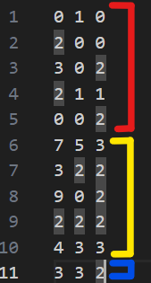
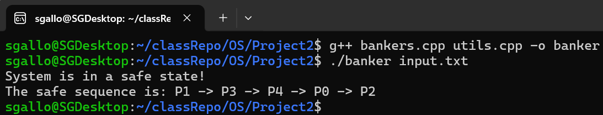

# CS 33211 Operating Systems Project 2: Bankers Algorithm for Deadlock Avoidance
 Bankers Algorithm for Deadlock Avoidance Project

 ## Project Description (Instructions given in class)
Consider a system with 
five processes P0 through P4 and three resources of type A, B, C.<br/>
Type A has 10 instances<br/>
Type B has 5 instances<br/>
Type C has 7 instances


Implement the Banker's algorithm to answer the following question: Is the system in a safe state? If yes, then what is the safe sequence?

## Implementation
I began by setting up my input file using the given values of the system snapshot at time t0.<br/>
My input file can be seen below.<br/>
-Lines 1-5 represent the allocation matrix<br/>
-Lines 6-10 represent the max matrix<br/>
-Line 11 represents the available resource array.<br/>
Each line represents a process and each row represents each processes allocation for resource type A, B, and C.
<br/>
<br/>
Inside of the program, I begin by reading in each character from the input file and storing them in the appropriate matrix/array.
From there, I calculated the need for each process of each resource and stored it in the need matrix by subtracting the allocation amount from the max.
Then I passed the allocation and need matrixs' as well as the available array into my safety check function which loops through each process and checks if the process's needs exceed the available resources. 
If so then we move onto the next resource and check until we find a process whos need is less than or equal to the available resources meaning it can acquire those resources and run.
Once we find one, we mark that process as complete inside of the procComplete array, add it to the safe sequence, then free up it's resources by adding it's allocation back to the available resources array.<br/>
We then continue to loop through processes until either all processes are able to allocate the necessary resources and are now completed (meaning the system is in a safe state), or not all process are able to allocate the necessary amount of resources for execution (meaning the system is not in a safe state).
If the system is in a safe state, then that is printed to the console alongside the safe sequence. Otherwise, "The system is not in a safe state" is printed to the console.<br/>
In the time snapshot provided, the system was in a safe state and the safe sequence was P1 -> P3 -> P4 -> P0 -> P2.


## To Compile and run
Compile and run using these commands in your Linux terminal

```bash
g++ bankers.cpp utils.cpp -o banker
./banker input.txt
```

## Examples

